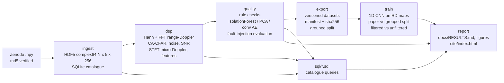

# radar-data-pipeline

A small, end-to-end radar data management pipeline on **real 77 GHz FMCW radar measurements**:
ingest into a chunked tensor store and a SQL catalogue, signal processing (range-Doppler, CA-CFAR,
SNR, micro-Doppler), data quality checks (documented rules and ML anomaly detection), versioned
AI-training datasets with a leakage-safe split, a small CNN classifier, and generated reports.

Every number in this README, in `docs/RESULTS.md` and on the static dashboard (`site/index.html`)
is written by the pipeline into `results/*.json` / `results/sql_*.csv` and rendered by
`scripts/report.py`. Nothing is typed by hand.

Live dashboard: https://huggingface.co/spaces/pavanyadava07/radar-data-pipeline (static, generated by `scripts/report.py`).

## Data

SAAB SIRS 1600 FMCW radar, 77 GHz, 160 MHz bandwidth (about 1 m range resolution), PRF 17 kHz,
mechanically scanning antenna. 130 measurements, 75,868 scan segments of 5 range cells x 256
slow-time (azimuth) samples (15 ms). Targets: six drones (D1-D6), walking and running humans,
several bird species, and a corner reflector. 67 segments are truncated at the field-of-view edge and
filled with noise (a real data-quality defect, used here as a real anomaly label).

> A. Karlsson, M. Jansson, M. Hamalainen, "Model-Aided Drone Classification Using Convolutional
> Neural Networks", IEEE Radar Conference 2022. Dataset: Zenodo,
> [10.5281/zenodo.5845259](https://doi.org/10.5281/zenodo.5845259), licensed
> [CC BY 4.0](https://creativecommons.org/licenses/by/4.0/). The data is not redistributed here;
> `scripts/download_data.sh` fetches it and verifies the published md5.

## Pipeline



| stage | command | output |
|---|---|---|
| download | `make data` | `data/raw/*.npy` (md5 checked) |
| ingest | `rdp ingest` | `data/derived/segments.h5`, `data/catalog.sqlite`, `results/ingest.json` |
| signal processing | `rdp dsp` | features in the catalogue + `features.parquet`, log RD maps, `results/dsp.json` |
| quality | `rdp quality` | rule flags + anomaly scores in the catalogue, `results/quality_rules.json`, `results/anomaly.json` |
| export | `rdp export` | `data/exports/<name>-v<version>/{arrays.npz,manifest.json}`, `results/manifest_*.json` |
| train | `rdp train` | `results/classifier.json` |
| SQL | `rdp sql-all`, `rdp query sql/<file>.sql` | `results/sql_*.csv` |
| report | `python scripts/report.py` | `docs/RESULTS.md`, `docs/figures/*.png`, `site/index.html`, block below |

## Results (generated)

<!-- RESULTS:BEGIN -->
| measured | value |
|---|---|
| segments / measurements | 75868 / 130 |
| exact duplicate segments found at ingest | 57 (incl. a seagull vs black-headed gull label conflict) |
| real segments with any integrity flag | 565 (0.7 %) |
| REAL edge-truncated segments, recall at 1 % FA: rules / IsolationForest / PCA / CAE | 0.31 / 0.00 / 0.07 / 0.03 |
| dropped_block (injected, synthetic), recall at 1 % FA: rules / IsolationForest / PCA / CAE | 1.00 / 0.01 / 0.04 / 0.01 |
| dc_leakage (injected, synthetic), recall at 1 % FA: rules / IsolationForest / PCA / CAE | 0.10 / 0.01 / 0.36 / 0.03 |
| range_offset (injected, synthetic), recall at 1 % FA: rules / IsolationForest / PCA / CAE | 0.97 / 0.24 / 0.88 / 0.52 |
| gain_drift (injected, synthetic), recall at 1 % FA: rules / IsolationForest / PCA / CAE | 0.01 / 0.01 / 0.02 / 0.01 |
| drone/bird/human/reflector CNN macro-F1: paper split vs grouped split | 0.990 vs 0.953 |
| 6 drone types CNN macro-F1: paper split vs grouped split | 0.980 vs 0.844 |
| quality filtering (grouped, class group): macro-F1 filtered vs unfiltered train set | 0.953 vs 0.956 |
<!-- RESULTS:END -->

Full tables and figures: [docs/RESULTS.md](docs/RESULTS.md). Static dashboard: `site/index.html`
(plain HTML + PNGs, works as a Hugging Face static Space).

### What the numbers say

- **The catalogue found real defects in the published data.** Hashing every segment at ingest
  revealed exact duplicate segments, including a block shared between a "seagull" and a
  "black-headed gull" measurement (a label conflict) and repeated segments inside corner-reflector
  measurements. Many duplicate pairs sit in different splits of the paper's per-sample split.
- **The paper's per-sample split leaks.** Every measurement contributes to train, val and test, and
  consecutive segments (100 ms apart) are near duplicates. The grouped split keeps each measurement
  (and every pair of measurements linked by a duplicate) in one split. Scores drop under the grouped
  split, a lot for the 6-drone task: the per-sample split overstates generalisation to new flights.
- **Rules beat unsupervised ML on the faults they are written for.** Dead, frozen, clipped and
  duplicated data are caught exactly by rules and are nearly invisible to IsolationForest, PCA and the
  convolutional autoencoder, whose scores are dominated by natural target variability
  (micro-Doppler, SNR, class). Several CAE ROC-AUCs are below 0.5: faults that remove energy make a
  map easier to reconstruct, not harder. ML adds value where no rule is sharp: PCA on the feature vector
  beats the rules on DC leakage and catches most range offsets (rules still higher there). Phase jumps
  are weakly detected and gain drift is not detected by anything here. The IsolationForest threshold set
  on validation measurements transfers badly to test measurements (far fewer alarms than the 1 % target),
  a reminder that per-measurement distribution shift matters for monitoring thresholds too.
- **The real edge-truncation defect is hard.** The edge-cliff rule was written after looking at a few
  of the 67 truncated segments (stated honestly; its threshold is set on clean training data only).
  It catches about a third of them at its deployed threshold; the ML detectors do worse.
- **Quality filtering changes classifier accuracy by less than the seed-to-seed spread** here, because
  under 1 % of segments are flagged.

## Run it

```bash
# environment (example with uv; any Python >= 3.10 works)
uv venv -p 3.11 .venv
uv pip install -p .venv/bin/python torch --index-url https://download.pytorch.org/whl/cu128   # or .../whl/cpu
uv pip install -p .venv/bin/python -r requirements.txt && uv pip install -p .venv/bin/python --no-deps -e .

make data          # 1.56 GB download + md5 check
make all           # ingest -> dsp -> quality -> export -> train -> sql -> report (about 5 min on an L4 host)
make test lint     # pytest (synthetic fixture, no download) + ruff
rdp query sql/duplicate_segments.sql
make docker        # CPU image: ruff + pytest + CLI
```

Derived data for the full dataset is about 1.3 GB (HDF5 780 MB, RD maps 195 MB, two exports 370 MB).

## Design notes

- **Signal processing.** Periodic Hann window over the 256 slow-time samples, FFT, `fftshift`; power
  normalised so a unit tone at a bin centre is 0 dB. Doppler axis `(k - 128) * 17 kHz / 256`
  (66.4 Hz bins, about +-16.5 m/s at 77 GHz). Note that the slow-time samples are taken while the
  antenna scans, so the antenna pattern modulates the target and widens its Doppler line.
  CA-CFAR along Doppler on the centre cell: 4 guard + 16 training cells each side, Pfa 1e-4,
  `alpha = N (Pfa^(-1/N) - 1)`. Noise floor = median RD power / ln 2. SNR = peak centre-cell RD power
  over the noise floor (it includes zero-Doppler clutter, so a static corner reflector has high SNR).
  Micro-Doppler bandwidth from a 64-sample / hop-16 STFT of the centre cell, bins 10 dB above the noise.
- **Rules** (`rdp/rules.py`): NaN/inf, dead block, frozen block, ADC rail clipping and sha1 duplicates
  use fixed thresholds; DC offset, impulsive spikes, off-centre target and edge cliff use the 99.9th
  percentile of the statistic on clean grouped-train segments. Low SNR and time gaps are stored as
  quality flags, not faults.
- **Anomaly protocol** (`rdp/quality.py`): clean = `edge_flag == 0` (rules are not used to define
  clean, so rule false alarms are measured). ML models are fitted on clean grouped-train only;
  deployed ML thresholds are the 99th percentile on clean grouped-val. Faults are injected into clean
  grouped-test segments and are always labelled "injected, synthetic". Reported: recall at the
  deployed threshold, recall at exactly 1 % false alarms on clean test, ROC-AUC.
- **Training data** (`configs/datasets.yaml`, `rdp/export.py`): manifest with dataset version, source
  md5, filters, class maps, counts per split and sha256 of each exported array (deterministic; tested).
  `rdp.dataset.RadarRDDataset` loads an export and can verify the checksums.

## Repository layout

```
rdp/            package: ingest, dsp, rules, faults, anomaly, quality, splits, export, dataset, models, train, cli
sql/            catalogue queries (class balance, quality flags, SNR, segments per measurement, gaps, duplicates, leakage)
configs/        versioned dataset definitions
scripts/        download_data.sh, report.py
tests/          DSP known-answer tests, rules on synthetic faults, splits, catalogue schema, manifest
                determinism, end-to-end run on a synthetic fixture
results/        machine-written JSON / CSV (committed)
docs/           RESULTS.md + figures (generated)
site/           static dashboard (generated)
```

## Limits

- One radar type and one site: a 77 GHz short-range FMCW sensor (targets at roughly 10-90 m), not a
  long-range surface or air-surveillance radar. Nothing here is validated for other radars.
- The data arrives already range-compressed and segmented around a detected target; raw ADC samples,
  tracks and the detection stage are not available, so ADC clipping and interference are approximated
  on range-compressed data.
- Injected faults are synthetic. Their amplitudes are physically motivated but chosen by me; recall
  numbers depend on those choices. The only real anomaly label is the 67 edge-truncated segments.
- Few measurements per class (4 measurements for D3/D4/D5, 1 each for pigeon and raven), so the grouped
  split has one or two measurements per class in val/test and the grouped scores have high variance
  that 3 seeds do not capture (seeds vary the model, not the measurement assignment).
- The edge-cliff rule was designed after inspecting edge segments, so its edge recall is optimistic
  relative to a rule written blind.
- The classifier is a small baseline for the split comparison, not a tuned model; no augmentation, no
  hyper-parameter search.

## License

Code: MIT (see `LICENSE`). Data: CC BY 4.0, A. Karlsson, M. Jansson, M. Hamalainen (not included).
