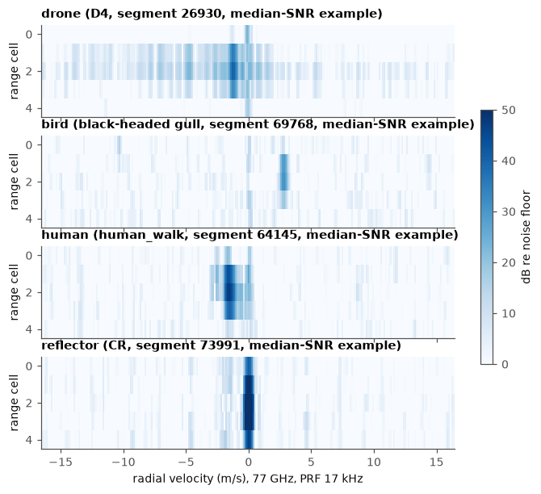
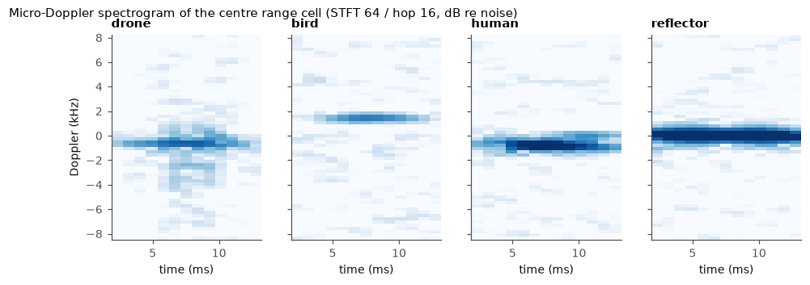
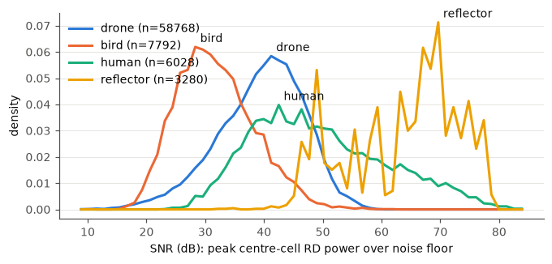
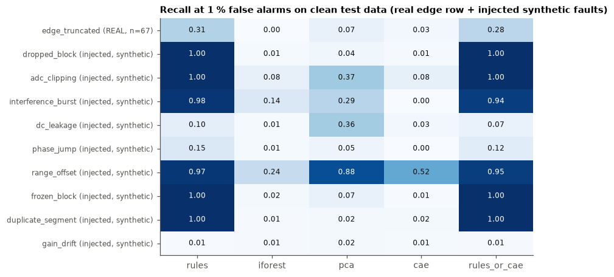
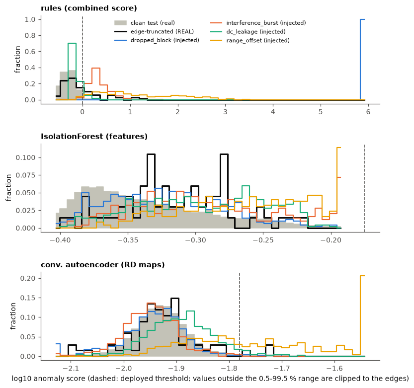
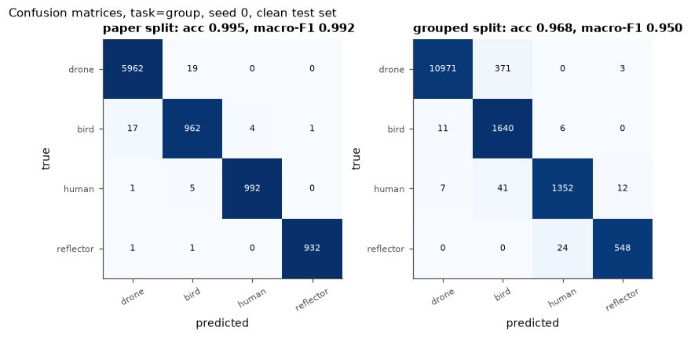
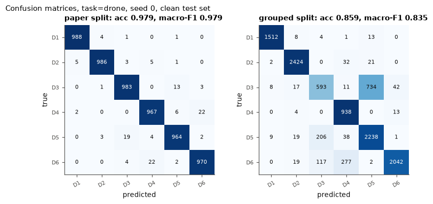

# Results

Generated by `scripts/report.py` from `results/*.json` and `results/sql_*.csv`. Do not edit by hand.
Hardware: AMD EPYC 7R13 Processor (32 threads), GPU NVIDIA L4.

## 1. Dataset and catalogue

Source `data_SAAB_SIRS_77GHz_FMCW.npy` md5 `01d66ba7b1ccc04477a9e69b2813f251`: 130 measurements, 75868 segments, 67 edge-truncated (dataset label), 57 exact duplicate segments found by sha1 at ingest. Ingest 1.04 s load + 1.31 s HDF5/SQLite write (HDF5 779 MB, complex64 [N, 5, 256]).

| label | measurements | segments |
|---|---|---|
| CR | 19 | 3280 |
| D1 | 8 | 6921 |
| D2 | 9 | 9555 |
| D3 | 4 | 10212 |
| D4 | 4 | 8735 |
| D5 | 4 | 12093 |
| D6 | 15 | 11252 |
| black-headed gull | 11 | 4364 |
| heron | 5 | 387 |
| human_run | 4 | 1499 |
| human_walk | 7 | 4529 |
| pigeon | 1 | 32 |
| raven | 1 | 19 |
| seagull | 34 | 2550 |
| seagull and black-headed gull | 4 | 440 |

Class balance per split (`sql/class_balance_per_split.sql`):

| class_group | paper_train | paper_val | paper_test | grouped_train | grouped_val | grouped_test | total |
|---|---|---|---|---|---|---|---|
| drone | 46768 | 6000 | 6000 | 34849 | 12499 | 11420 | 58768 |
| bird | 5792 | 1000 | 1000 | 4650 | 1454 | 1688 | 7792 |
| human | 4028 | 1000 | 1000 | 3188 | 1426 | 1414 | 6028 |
| reflector | 1280 | 1000 | 1000 | 1979 | 668 | 633 | 3280 |

Leakage check (`sql/split_leakage.sql`): measurements with segments in more than one split.

| split_kind | measurements_in_multiple_splits | measurements |
|---|---|---|
| paper_split | 130 | 130 |
| split_grouped | 0 | 130 |

Exact duplicate segments (`sql/duplicate_segments.sql`). Measurements linked by duplicates [[88, 98], [104, 105]] are kept in the same grouped split.

| meas_a | label_a | meas_b | label_b | duplicate_pairs | pairs_across_paper_splits | label_conflict |
|---|---|---|---|---|---|---|
| 125 | CR | 125 | CR | 55 | 34 | 0 |
| 88 | seagull | 98 | black-headed gull | 33 | 15 | 1 |
| 115 | CR | 115 | CR | 10 | 7 | 0 |
| 104 | black-headed gull | 105 | black-headed gull | 6 | 3 | 0 |
| 112 | CR | 112 | CR | 3 | 2 | 0 |
| 118 | CR | 118 | CR | 3 | 2 | 0 |

## 2. Signal processing







Doppler resolution 66.4 Hz, span -8500 to 8434 Hz (-16.55 to 16.42 m/s). CA-CFAR: guard 4, train 16 each side, Pfa 0.0001, alpha 10.673. DSP over all segments: 8.48 s (8945.9 segments/s, CPU (numpy, single process)).

| class group | SNR median (dB) | p10 | p90 |
|---|---|---|---|
| drone | 40.29 | 29.68 | 48.26 |
| bird | 31.05 | 23.69 | 40.55 |
| human | 47.84 | 35.81 | 65.99 |
| reflector | 66.33 | 48.9 | 75.03 |

Feature medians per class group:

| class group | doppler_spread_hz | md_bandwidth_hz | spectral_entropy | n_cfar | zero_doppler_ratio |
|---|---|---|---|---|---|
| drone | 655.091 | 2799.279 | 0.356 | 5.0 | 0.396 |
| bird | 770.006 | 878.606 | 0.414 | 5.0 | 0.007 |
| human | 240.278 | 2492.789 | 0.353 | 5.0 | 0.006 |
| reflector | 61.83 | 2125.0 | 0.235 | 6.0 | 0.997 |

## 3. Data quality

### Rule checks on the real data

Thresholds (hard rules fixed in config.py; statistical rules = 99.9th percentile on clean grouped-train):

| rule | threshold |
|---|---|
| nonfinite | 1.0 |
| dead_block | 16.0 |
| frozen_block | 8.0 |
| clipping | 6.0 |
| duplicate | 1.0 |
| dc_offset | 0.5339 |
| spike | 10.1569 |
| off_centre | 1.1788 |
| edge_cliff | 1.4515 |

| rule | drone | bird | human | reflector |
|---|---|---|---|---|
| nonfinite | 0 | 0 | 0 | 0 |
| dead_block | 0 | 0 | 0 | 0 |
| frozen_block | 0 | 0 | 0 | 0 |
| clipping | 0 | 0 | 0 | 0 |
| duplicate | 0 | 39 | 0 | 18 |
| dc_offset | 2 | 0 | 0 | 44 |
| spike | 106 | 3 | 2 | 152 |
| off_centre | 38 | 40 | 4 | 0 |
| edge_cliff | 94 | 35 | 4 | 0 |

Any integrity flag on real data: 565 segments (0.7 %). Low-SNR (< 6.0 dB) segments: 0 (the published segments were already selected for a visible target). Time gaps > 0.5 s: 471. Edge-truncated segments caught by the edge-cliff rule: 20 of 67.

Per label (`sql/quality_flags_per_class.sql`):

| label | n_segments | edge_truncated | any_rule_flag | rule_flag_pct | low_snr | time_gap_before |
|---|---|---|---|---|---|---|
| D5 | 12093 | 0 | 131 | 1.08 | 0 | 38 |
| D6 | 11252 | 8 | 48 | 0.43 | 0 | 61 |
| D3 | 10212 | 0 | 0 | 0.0 | 0 | 7 |
| D2 | 9555 | 0 | 4 | 0.04 | 0 | 2 |
| D4 | 8735 | 3 | 22 | 0.25 | 0 | 11 |
| D1 | 6921 | 0 | 28 | 0.4 | 0 | 24 |
| human_walk | 4529 | 0 | 4 | 0.09 | 0 | 6 |
| black-headed gull | 4364 | 7 | 70 | 1.6 | 0 | 192 |
| CR | 3280 | 0 | 210 | 6.4 | 0 | 1 |
| seagull | 2550 | 43 | 30 | 1.18 | 0 | 99 |
| human_run | 1499 | 0 | 5 | 0.33 | 0 | 3 |
| seagull and black-headed gull | 440 | 0 | 1 | 0.23 | 0 | 20 |
| heron | 387 | 0 | 0 | 0.0 | 0 | 6 |
| pigeon | 32 | 4 | 6 | 18.75 | 0 | 1 |
| raven | 19 | 2 | 6 | 31.58 | 0 | 0 |

### Rules vs ML anomaly detection

```
Stage 3: rule checks on the real data + ML anomaly detection, evaluated on
(a) the REAL edge-truncated segments and (b) INJECTED (synthetic) faults on grouped-test segments.

Protocol
- "clean" = edge_flag == 0 (the dataset's own label). Rules are NOT used to define clean,
  so rule false alarms on clean data are measured, not assumed away.
- Statistical rule thresholds and all ML models are fitted on clean grouped-TRAIN only.
- ML deployed threshold = 99th percentile of the score on clean grouped-VAL (target 1 % FA).
- Faults are injected into randomly chosen clean grouped-TEST segments; negatives are all
  clean grouped-TEST segments.
```

Clean train / val / test: 44627 / 16045 / 15129 segments, 500 injected segments per fault.

False-alarm rate at the deployed threshold:

| method | clean val | clean test |
|---|---|---|
| rules | 1.1 % | 0.9 % |
| iforest | 1.0 % | 0.0 % |
| pca | 1.0 % | 0.8 % |
| cae | 1.0 % | 1.4 % |
| rules_or_cae | 2.1 % | 2.3 % |

Per fault: recall at deployed threshold / recall at exactly 1 % FA on clean test / ROC-AUC. `rules_or_cae` = OR of both detectors.

| fault | n | rules | iforest | pca | cae | rules_or_cae |
|---|---|---|---|---|---|---|
| edge_truncated (REAL, n=67) | 67 | 0.31 / 0.31 / 0.72 | 0.00 / 0.00 / 0.67 | 0.06 / 0.07 / 0.63 | 0.04 / 0.03 / 0.50 | 0.34 / 0.28 / 0.73 |
| dropped_block (injected, synthetic) | 500 | 1.00 / 1.00 / 1.00 | 0.00 / 0.01 / 0.61 | 0.03 / 0.04 / 0.63 | 0.01 / 0.01 / 0.42 | 1.00 / 1.00 / 1.00 |
| adc_clipping (injected, synthetic) | 500 | 1.00 / 1.00 / 1.00 | 0.00 / 0.08 / 0.90 | 0.34 / 0.37 / 0.95 | 0.11 / 0.08 / 0.80 | 1.00 / 1.00 / 1.00 |
| interference_burst (injected, synthetic) | 500 | 0.97 / 0.98 / 0.99 | 0.03 / 0.14 / 0.75 | 0.28 / 0.29 / 0.80 | 0.00 / 0.00 / 0.38 | 0.98 / 0.94 / 1.00 |
| dc_leakage (injected, synthetic) | 500 | 0.09 / 0.10 / 0.81 | 0.00 / 0.01 / 0.75 | 0.34 / 0.36 / 0.88 | 0.04 / 0.03 / 0.69 | 0.13 / 0.07 / 0.72 |
| phase_jump (injected, synthetic) | 500 | 0.14 / 0.15 / 0.65 | 0.00 / 0.01 / 0.54 | 0.05 / 0.05 / 0.54 | 0.00 / 0.00 / 0.35 | 0.15 / 0.12 / 0.56 |
| range_offset (injected, synthetic) | 500 | 0.97 / 0.97 / 1.00 | 0.01 / 0.24 / 0.87 | 0.88 / 0.88 / 0.98 | 0.56 / 0.52 / 0.92 | 0.97 / 0.95 / 1.00 |
| frozen_block (injected, synthetic) | 500 | 1.00 / 1.00 / 1.00 | 0.00 / 0.02 / 0.59 | 0.07 / 0.07 / 0.62 | 0.01 / 0.01 / 0.41 | 1.00 / 1.00 / 1.00 |
| duplicate_segment (injected, synthetic) | 500 | 1.00 / 1.00 / 1.00 | 0.00 / 0.01 / 0.50 | 0.02 / 0.02 / 0.51 | 0.02 / 0.02 / 0.51 | 1.00 / 1.00 / 1.00 |
| gain_drift (injected, synthetic) | 500 | 0.01 / 0.01 / 0.49 | 0.00 / 0.01 / 0.56 | 0.02 / 0.02 / 0.57 | 0.03 / 0.01 / 0.49 | 0.03 / 0.01 / 0.49 |





Which rules fire per injected fault (fraction of injected segments):

| fault | rules firing |
|---|---|
| dropped_block | dead_block 1.00, frozen_block 1.00, dc_offset 0.01, spike 0.10, edge_cliff 0.04 |
| adc_clipping | clipping 1.00, dc_offset 0.03, spike 0.01, edge_cliff 0.00 |
| interference_burst | spike 0.96, off_centre 0.01, edge_cliff 0.39 |
| dc_leakage | spike 0.00, off_centre 0.09 |
| phase_jump | spike 0.14, off_centre 0.00, edge_cliff 0.00 |
| range_offset | spike 0.01, off_centre 0.97 |
| frozen_block | frozen_block 1.00, clipping 0.02, dc_offset 0.00, spike 0.11, off_centre 0.00, edge_cliff 0.04 |
| duplicate_segment | duplicate 1.00, spike 0.01, edge_cliff 0.00 |
| gain_drift | spike 0.01, edge_cliff 0.00 |

Timing: feature detectors fit 0.55 s (CPU), autoencoder 15 epochs in 7.38 s on NVIDIA L4.

## 4. Versioned training datasets

| dataset | version | filters | segments | sha256(x_rd_db) |
|---|---|---|---|---|
| rd_clean | 1.0.0 | {"edge_flag": 0, "rule_flags": 0} | 75257 | 71a07253332bf905... |
| rd_all | 1.0.0 | {} | 75868 | 7959ceadbe437f72... |

## 5. Classifier: paper split vs grouped split

```
Stage 5: train a small CNN on log RD maps; paper split vs grouped split, filtered vs unfiltered.

Experiments (each over SEEDS):
  task=group (drone/bird/human/reflector): train set rd_clean or rd_all  x  split paper or grouped
  task=drone (D1-D6):                      train set rd_clean            x  split paper or grouped
Every model is evaluated on the test split of rd_clean (same rows for both training sets)
and on the test split of rd_all. Model selection: epoch with best val macro-F1.
```

| task | split | train set | n clean test | acc (clean test) | macro-F1 (clean test) | acc (all test) | macro-F1 (all test) | train s / run |
|---|---|---|---|---|---|---|---|---|
| group | paper | rd_clean | 8897 | 0.9937 +- 0.0007 | 0.9900 +- 0.0013 | 0.9934 | 0.9895 | 10.53 |
| group | paper | rd_all | 8897 | 0.9934 +- 0.0004 | 0.9899 +- 0.0010 | 0.9933 | 0.9897 | 12.33 |
| drone | paper | rd_clean | 5981 | 0.9797 +- 0.0010 | 0.9797 +- 0.0010 | 0.9798 | 0.9798 | 9.01 |
| group | grouped | rd_clean | 14986 | 0.9701 +- 0.0029 | 0.9534 +- 0.0023 | 0.9691 | 0.9519 | 14.04 |
| group | grouped | rd_all | 14986 | 0.9700 +- 0.0029 | 0.9555 +- 0.0041 | 0.9692 | 0.9540 | 13.77 |
| drone | grouped | rd_clean | 11345 | 0.8632 +- 0.0129 | 0.8435 +- 0.0143 | 0.8626 | 0.8427 | 11.3 |

Mean +- std over seeds [0, 1, 2], 12 epochs, GPU NVIDIA L4.





